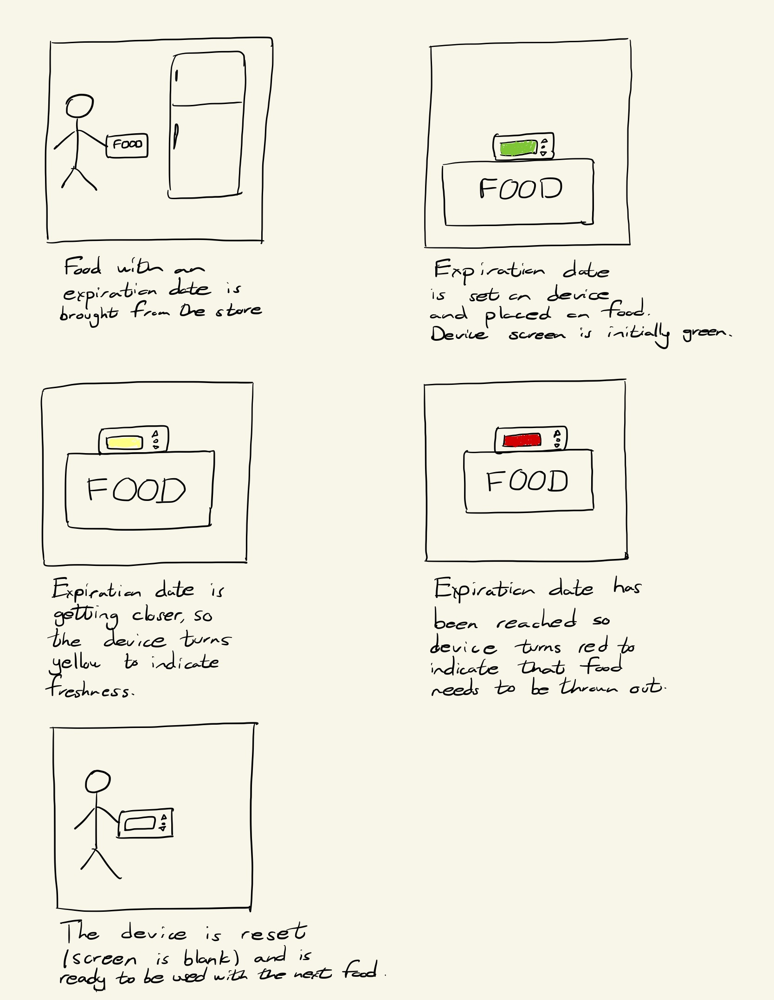
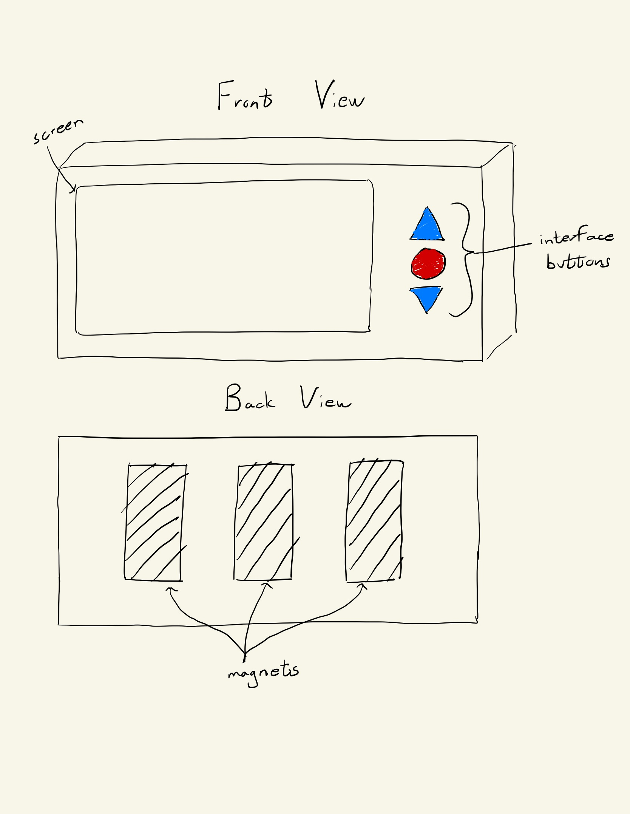

# Staging Interaction

In the original stage production of Peter Pan, Tinker Bell was represented by a darting light created by a small handheld mirror off-stage, reflecting a little circle of light from a powerful lamp. Tinkerbell communicates her presence through this light to the other characters. See more info [here](https://en.wikipedia.org/wiki/Tinker_Bell). 

There is no actor that plays Tinkerbell--her existence in the play comes from the interactions that the other characters have with her.

For lab this week, we draw on this and other inspirations from theatre to stage interactions with a device where the main mode of display/output for the interactive device you are designing is lighting. You will plot the interaction with a storyboard, and use your computer and a smartphone to experiment with what the interactions will look and feel like. _Make sure you read all the instructions and understand the whole of the laboratory activity before starting!_

## Prep

1. Set up [your Github "Lab Hub" repository](../../../) by [following these instructions](https://github.com/FAR-Lab/Developing-and-Designing-Interactive-Devices/blob/2021Spring/readings/Submitting%20Labs.md).
2. Set up the README.md for your Hub repository (for instance, so that it has your name and points to your own Lab 1) and [learn how](https://guides.github.com/features/mastering-markdown/) to post links to your submissions on your readme.md so we can find them easily.

### For lab, you will need:

1. Paper
1. Markers/ Pen
1. Smart Phone--Main required feature is that the phone needs to have a browser and display a webpage.
1. Computer--we will use your computer to host a webpage which also features controls
1. Found objects and materials--you’ll have to costume your phone so that it looks like some other device. These materials can include doll clothes, a paper lantern, a bottle, human clothes, a pillow case. Be creative!
1. Scissors

### Deliverables for this lab are: 
1. Storyboard
1. Sketches/photos of costumed device
1. Any reflections you have on the process.
1. Video sketch of the prototyped interaction.
1. Submit these in the lab1 folder of your class [Github page], either as links or uploaded files. Each group member should post their own copy of the work to their own Lab Hub, even if some of the work is the same for each person in the group.

## Overview
For this assignment, you are going to 

A) [Plan](#part-a-plan) 

B) [Act out the interaction](#part-b-act-out-the-interaction) 

C) [Prototype the device](#part-c-prototype-the-device)

D) [Wizard the device](#part-d-wizard-the-device) 

E) [Costume the device](#part-e-costume-the-device)

F) [Record the interaction](#part-f-record)

## The Report
This readme.md page in your own repository should be edited to include the work you have done. You can delete everything but the headers and the sections between the **stars**. Write the answers to the questions under the starred sentences. Include any material that explains what you did in this lab hub folder, and link it in the readme.

Labs are due on Mondays. Make sure this page is linked to on your main class hub page.

## Part A. Plan 

To stage the interaction with your interactive device, think about:

_Setting:_ Where is this interaction happening? (e.g., a jungle, the kitchen) When is it happening?

_Players:_ Who is involved in the interaction? Who else is there? If you reflect on the design of current day interactive devices like the Amazon Alexa, it’s clear they didn’t take into account people who had roommates, or the presence of children. Think through all the people who are in the setting.

_Activity:_ What is happening between the actors?

_Goals:_ What are the goals of each player? (e.g., jumping to a tree, opening the fridge). 

The interactive device can be anything *except* a computer, a tablet computer or a smart phone, but the main way it interacts needs to be using light.
**Describe your setting, players, activity and goals here.**

The setting for the activity is a refrigerator and the players are the individuals inhabiting the location that has the refrigerator. The device can be used to determine the freshness of certain foods in the refrigerator. As soon as the food is purchased or made, the user sets the expiration date for the food on the device. Initially, the device outputs green light and a smiley face to indicate to the players that the food is still fresh, but overtime the light turns yellow (with a neutral face) and then red (with an angry face) to indicate that the food starting to rot. In addition, there is a webapp that displays the conditions of the various foods tracked by the devices. The webapp also has a calendar feature that can be used to schedule when a particular food will be consumed by the user. The goal of the players is to interact with the device to determine the freshness of the food and consume the food before the food spoils and the light on the device turns red. 

Sketch a storyboard of the interactions you are planning. It does not need to be perfect, but must get across the behavior of the interactive device and the other characters in the scene. 
**Include a picture of your storyboard here**

Present your idea to the other people in your breakout room. You can just get feedback from one another or you can work together on the other parts of the lab.
**Summarize feedback you got here.**

Person A - "This device could potentially be included inside smartfridges to track and automatically orders whatever food spoils or runs out."
Person B - "One device could potentially be used to track the quality of many foods to save resources."

## Part B. Act out the Interaction

Try physically acting out the interaction you planned. For now, you can just pretend the device is doing the things you’ve scripted for it. 

**Are there things that seemed better on paper than acted out?**

The buttons on the device were simpler to use than initially imagined because of their limited functionality. The buttons felt simple to use because the input was limited to "number of days till expiration" rather than "best by date" input. As a result, the user just had to play around with a basic counter to put in the expiration date instead of worrying about finding the date on a calendar.  

**Are there new ideas that occur to you or your collaborators that come up from the acting?**

It would be interesting if the screen had capabilities for emojis or images that conveyed the state of the food. This way, the food can be given some sort of personality which could lead to an interesting interactions.

## Part C. Prototype the device

You will be using your smartphone as a stand-in for the device you are prototyping. You will use the browser of your smart phone to act as a “light” and use a remote control interface to remotely change the light on that device. 

Code for the "Tinkerbelle" tool, and instructions for setting up the server and your phone are [here](https://github.com/FAR-Lab/tinkerbelle).

We invented this tool for this lab! 

If you run into technical issues with this tool, you can also use a light switch, dimmer, etc. that you can can manually or remotely control.

**Give us feedback on Tinkerbelle.**

Tinkerbelle could have presented ways to put different shapes on the screen to indicate custom buttons. The app could have also allowed for specific sections of the screen to output different colors. This way, the users could have an easier time developing more elaborate prototypes.  

## Part D. Wizard the device
Take a little time to set up the wizarding set-up that allows for someone to remotely control the device while someone acts with it. Hint: You can use Zoom to record videos, and you can pin someone’s video feed if that is the scene which you want to record. 

**Include your first attempts at recording the set-up video here.**

The video shows the first part of the goal which is to have the phone connect to the server established on the desktop. Then when the color on the server was changed to green, the phone screen also changed to green. The green indicates that the food is fresh.

Link to Video: https://drive.google.com/file/d/17FmH0yKVu2lY6_4bS3hzo0GJDubrJXR7/view?usp=sharing

Now, change the goal within the same setting, and update the interaction with the paper prototype. 

**Show the follow-up work here.**

The video shows the screen changing from green to red which is a part of the goal when the food starts to spoil.

Link to Video: https://drive.google.com/file/d/1Y_OJBLNz67Xb3dKK_k8LHMnq_7C79gSY/view?usp=sharing

## Part E. Costume the device

Only now should you start worrying about what the device should look like. Develop a costume so that you can use your phone as this device.

Think about the setting of the device: is the environment a place where the device could overheat? Is water a danger? Does it need to have bright colors in an emergency setting?

**Include sketches of what your device might look like here.**

**What concerns or opportunitities are influencing the way you've designed the device to look?**

The front view shows a screen, two arrow buttons, and a round button. The screen was chosen to act as a menu for selecting when the food will expire and for displaying the condition of the food. The arrow buttons were chosen as a simple way to count up or down for the number of days before expiration, and the round button was chosen to serve as a selection and reset mechanism. The arrow shape of the button conveys the direction along which the number of days changes and the round shape was chosen to be a neutral figure between the arrows. 

The back view of the device shows magnets attached to the device. The magnets were chosen as a way to fasten the device to a food container. The food container would also need to be embedded with magnets to help attach the device to the food.

The outer shell of the device will be made out of an insulating material like plastic, because the device will often be exposed to cold settings like the refrigerator. The plastic case will allow the device to not be extremely cool to the touch when interacting with it in the cold. 

## Part F. Record

**Take a video of your prototyped interaction.**

Link to video: https://drive.google.com/file/d/1A66iYNVVojUQeOM21AeL0pkRH1EdAVkh/view?usp=sharing

**Please indicate anyone you collaborated with on this Lab.**
Be generous in acknowledging their contributions! And also recognizing any other influences (e.g. from YouTube, Github, Twitter) that informed your design. 

Andrew Tsai helped me film the video and operate Tinkerbelle.

# Staging Interaction, Part 2 

This describes the second week's work for this lab activity.

## Prep (to be done before Lab on Wednesday)

You will be assigned three partners from another group. Go to their github pages, view their videos, and provide them with reactions, suggestions & feedback: explain to them what you saw happening in their video. Guess the scene and the goals of the character. Ask them about anything that wasn’t clear. 

**Summarize feedback from your partners here.**

Caitlin Stanton - "I thought it was interesting your prototype is a magnet that can be affixed to a container, because my initial thought was having the device be the container itself. There are pros and cons to each (the former is a little more flexible but the food containers need magnets, the latter is more convenient but may be more expensive). I was wondering how it would be used for food that has an expiration date when unopened and another once opened: is the interface to just set a time range that it's okay to eat, rather than explicitly only using the expiration date? It would be useful to maybe have a central device on the outside of your fridge or a connected phone app to have a centralized list of all of the devices in your fridge, because otherwise it might still get pushed back into the fridge and forgotten."

Priya Kattappurath - "I was thinking it might be cool if your device had some way of notifying the user that the light would turn red soon, like if it was tied to an app to give a phone notification, or if it beeped when the fridge was opened?"

Grace Tan - " I really like your idea. I liked how it can be easily put on your food! Can you just scan it on food or do you have to leave it on your food the whole time? I also think it would be nice if it can flash or something if you open the fridge and you have to eat something before it's bad, or like toss it out."

## Make it your own

Do last week’s assignment again, but this time: 
1) It doesn’t have to (just) use light, 
2) You can use any modality (e.g., vibration, sound) to prototype the behaviors, 
3) We will be grading with an emphasis on creativity. 

**Document everything here.**
